# Algorithmic Magic the Gathering Drafting

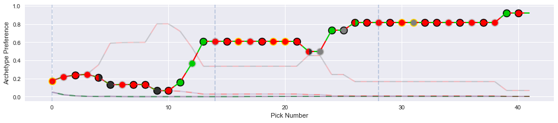

This library implements an algorithmic drafting strategy for Magic: The Gathering, in the spirit of [MTG: Arena](https://en.wikipedia.org/wiki/Magic:_The_Gathering_Arena). It supports the ability to simulate drafters, and can learn a draft strategy from records of past drafts.

  * [Installation](#installation)
  * [An Introduction to Drafting Magic: The Gathering](#an-introduction-to-drafting-magic-the-gathering)
     * [Magic Sets](#magic-sets)
     * [Features of Magic Cards](#features-of-magic-cards)
     * [Magic Decks](#magic-decks)
     * [The Drafting Process](#the-drafting-process)
  * [Simulation](#simulation)
     * [Algorithm Description](#algorithm-description)
     * [Getting Set Metadata](#getting-set-metadata)
     * [Constructing Draft Archetype Weights](#constructing-draft-archetype-weights)
     * [Using the Simulation Code](#using-the-simulation-code)
     * [Saving Simulated Draft Data](#saving-simulated-draft-data)
     * [Plotting the Draft Picks](#plotting-the-draft-picks)
  * [Machine Learning](#machine-learning)
     * [Training Data](#training-data)
     * [Training a Model](#training-a-model)
     * [Inspecting the Fit Weights](#inspecting-the-fit-weights)
     * [Simulating Drafts with Learned Weights](#simulating-drafts-with-learned-weights)
  * [Further Work](#further-work)
     * [Non-Linear Preferences](#non-linear-preferences)
     * [Memory and Other Information](#memory-and-other-information)

## Installation

The `mtg-draftbot` library can be installed directly from github.

```
pip install git+https://github.com/madrury/mtg-draftbot.git
```

To use some of the data processing scripts provided, you will need to install the `jq` JSON processing tool.

## An Introduction to Drafting Magic: The Gathering

[Magic: The Gathering](https://en.wikipedia.org/wiki/Magic:_The_Gathering) is a popular [collectable card game](https://en.wikipedia.org/wiki/Collectible_card_game) featuring deep and complex gameplay. Magic is played with a custom set of cards, and new sets of cards are released frequently. Booster draft is a specific way of playing Magic that does not use a players pre-existing collection of cards, thus supplying a fair field for testing the skill of players.

In booster draft the player must construct a deck of Magic cards in real time by choosing cards from a random pool, which is different every time the player drafts. This project's goal is twofold:

  - Algorithmatize the card selection problem in booster draft.
  - Provide an method for learning the parameters of the draft algorithm from real world draft data.

This library contains modules providing solutions to both of these problems.

### Magic Sets

Magic cards are periodically (about once a quarter) released in **sets**, with each set containing approximately 250 new cards. In booster draft, players are using one and only one set of cards. Throughout this documentation we will use examples from the most recent set, the [2020 Core Set](https://scryfall.com/sets/m20).

### Features of Magic Cards

The most important feature of a Magic card, for purposes of learning to draft, is its **color identity**. Each card in Magic has a color identity, which is made up of one, or multiple, of five colors: **white, blue, black, red, and green**.

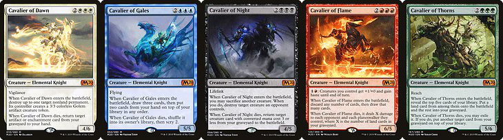

Above are examples of Magic cards, one of each possible single color. From left to right, _Cavalier of Dawn_ is white, _Cavalier of Gales_ is blue, _Cavalier of Night_ is black, _Cavalier of Flames_ is red, and _cavalier of Thorns_ is green.

There are also multi-colored cards:

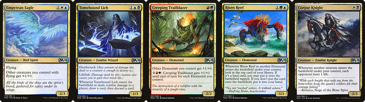

The color identity of each of these cards is a *pair* of colors.  The first is white-blue, the second blue-black, the third red-green, the fourth green-blue, and the final is white-black. Each color and color pair has gameplay strengths and weaknesses in a actual gameplay, but that will not concern us in this project.

A secondary feature of Magic cards that will be of some importance to us is their **rarity**. Some cards are more easily acquired than others, with less common cards having generally more powerful effects in game. There are four discrete rarities of cards: **commons, uncommons, rares, and mythics**.

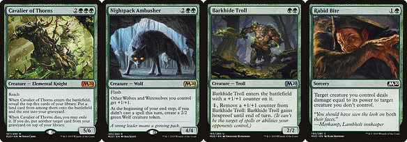

Above, each card has a different rarity, as indicated by the color of the M20 symbol. _Cavalier of Thorns_ is mythic, _Nightpack Ambusher_ is rare, _Barkhide Troll_ is an uncommon, and _Rabid Bite_ is common.

### Magic Decks

The color identity of cards is very important when constructing Magic decks, due to the way resources are acquired and managed in Magic.

There are five basic resource generating cards in Magic: the Gathering, the **basic lands**.

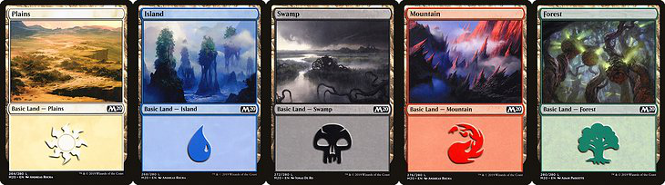

Lands are used to generate **mana** which is needed to actually use cards in game, and each land can only be used to generate one mana each turn. Mana is a colored resource:

  - _Plains_ generate white mana.
  - _Islands_ generate blue mana.
  - _Swamps_ generate black mana.
  - _Mountains_ generate red mana.
  - _Forests_ generate green mana.

A blue card requires blue mana to use, and so a player needs an _Island_ in play to use a blue card. A blue-white card, such as _Empyrian Eagle_ above, requires *both* blue *and* white mana, so a player must have *both* an _Island_ and a _Plains_ in play to use _Empyrian Eagle_. Since:

  - It is a basic rule of magic that only one card is drawn each turn, and only one land can be played each turn.
  - Lands must be put in the players deck, just like all other cards, meaning not every land type is always available due to draw variance.

this balance of resources tends to push Magic decks to contain only a few colors of cards. **Most successful Magic: The Gathering decks contain cards of only two colors**.

This two color identity of a Magic deck is, loosely, referred to as the deck's **archetype**. A successful deck has a clear and well defined archetype, so the main constraint when building a deck is to ensure that the player has a sufficient number of cards that fit into a single archetype. The simplest version of this is ensuring that the player has a sufficient number of cards in at least one color pair.

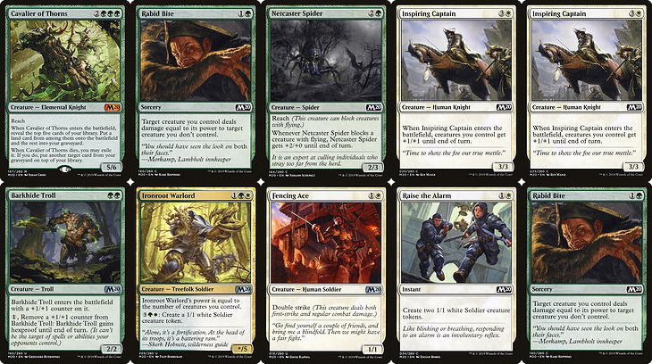

Above is a sample of cards from a Magic: The Gathering deck. Notice that each card is one of two colors: either white or green. Loosely speaking, this situation is representative of any successful Magic deck (at least in booster draft).

### The Drafting Process

Booster drafts involve eight different players each attempting to build a deck from a shared pool of cards.

To begin the draft, each player receives a random pack of 14 cards. The drafter's task is to take one of these cards for their deck, then the rest are passed to the drafter sitting to the left. This process continues, now with 13 cards to choose from, one is taken, the rest is passed. This continues until each drafter is forced to take the final card left in a pack. This entire process is then repeated two more times, resulting in each drafter holding 14 × 3 = 42 cards from which to construct a deck.

Since the goal of the drafter is (again, this is a simplified picture) to end up with a deck that fits cleanly into one of the two color archetypes, each drafter must eventually commit to taking cards identifying with a color pair (i.e. only take white or green cards, when possible). Therefore the process of drafting has an explore / exploit mechanic where the drafter both influences what colors are available to the drafters they pass to, and receives information about what colors are available from the drafter passing to them.

Our algorithm will manage this by tracking an internal state for each drafter indicating their preference for each possible archetype (generally, color pairs).

## Simulation

### Algorithm Description

Our simulation algorithm requires enumerating the deck archetypes in the set. As discussed above, a default definition of deck archetypes is the set of color pairs.

Each card in the set is given a **archetype weight** measuring its desirability within each possible archetype:

```
{
    "Act of Treason": {
        "WU": 0.0, "WB": 0.0, "WR": 1.0, "WG": 0.0, "UB": 0.0,
	"UR": 1.0, "UG": 0.0, "BR": 1.0, "BG": 0.0, "RG": 1.0}, 
    "Aerial Assault": {
        "WU": 1.0, "WB": 1.0, "WR": 1.0, "WG": 1.0, "UB": 0.0,
	"UR": 0.0, "UG": 0.0, "BR": 0.0, "BG": 0.0, "RG": 0.0},
    "Aether Gust": {
        "WU": 1.1, "WB": 0.0, "WR": 0.0, "WG": 0.0, "UB": 1.1,
	"UR": 1.1, "UG": 1.1, "BR": 0.0, "BG": 0.0, "RG": 0.0},
    ...
}
```

We have provided utilities for generating default archetype weights, see below.

Given a single drafter considering a single pick from some number of available cards, the **preference** of the drafter for each available card is computed as a two stage process. First, the preference of the drafter for each *archetype* is computed, we call these the drafter's current **archetype preferences**. These preferences roughly corresponds to how "committed" the drafter is to that archetype. The archetype preferences are functions of the cards chosen by the drafter in precious picks from the draft (though they could also incorporate other information, see the **further work** section of this documentation). 

Specifically, each currently held card contributes its archetype weight additively to the drafter's preferences for each archetype. I.e., the drafters preference for the white-blue archetype is the total weight of all the cards held by the drafter in the white-blue archetype. Its easy to verify that this can be statically computed as a matrix product:

```
drafter_archetype_preferences = current_cards_held @ card_archetype_weights
```

Given these archetype preferences, the drafter's preference for each available *card* is computed as a dot product between the drafter's current archetype preference vector, and the archetype weight vector of the card:

```
drafter_card_preference = dot(card_archetype_weights, drafter_archetype_perferences)
```

These preferences are now interpreted as log-probabilities. Applying a softmax function gives card pick probabilities, and we can use them to take a card by either choosing the most likely card, or drawing from the resulting categorical distribution over the available cards.

Notice that after choosing a card, the drafters archetype preferences change by adding the archetype weights for the chosen card to the drafters internal archetype preferences. In this way, each drafter develops a commitment to some archetype or archetypes as the draft progresses; they become more likely to choose cards in their preferred archetype(s).

### Getting Set Metadata

You will need some metadata on the set you would like to draft. This is supplied my [mtgjson](https://mtgjson.com/), and contains information like card names, rarities, and color identities. You'll want to download the complete JSON file for the set you are interested in from [here](https://mtgjson.com/downloads/sets/)

Once you have downloaded the set metadata file, the `scripts` directory contains some utilities for processing them into the form used by the simulation algorithm.

The `subset-json.jq` script will pull out only the fields in the raw set JSON that are needed for the simulation:

```
$ cat M20.json | ./scripts/subset-json.jq > m20-cards.json
```

### Constructing Draft Archetype Weights

The card archetype weights are stored in a JSON file which is loaded at draft time. This data is structures as a nested dictionary, with archetype names as keys in the inner dictionary.

```
{
    "Act of Treason": {
        "WU": 0.0, "WB": 0.0, "WR": 1.0, "WG": 0.0, "UB": 0.0,
	"UR": 1.0, "UG": 0.0, "BR": 1.0, "BG": 0.0, "RG": 1.0}, 
    "Aerial Assault": {
        "WU": 1.0, "WB": 1.0, "WR": 1.0, "WG": 1.0, "UB": 0.0,
	"UR": 0.0, "UG": 0.0, "BR": 0.0, "BG": 0.0, "RG": 0.0},
    "Aether Gust": {
        "WU": 1.1, "WB": 0.0, "WR": 0.0, "WG": 0.0, "UB": 1.1,
	"UR": 1.1, "UG": 1.1, "BR": 0.0, "BG": 0.0, "RG": 0.0},
    ...
}
```

To create a default archetype weights file, use the `make-default-card-values.py` script:

```
$ python scripts/make-default-card-values.py m20-cards.json > m20-default-weights.json
```

This script creates a default weight for each card in each archetype based on the card's color identity and rarity.

You may want to edit these default weights with your own opinions about what cards are good or bad, or to achieve some desirable behaviour from the simulated drafters. The nested dictionary format is not particularly useful for editing, so you may want to use the `dicts-to-tuples` dictionary of tuples format that is more convenient for editing:

```
$ python scripts/dicts-to-tuples.py < m20-weights.json

{
    "archetype_names": [
        "WU", "WB", "WR", "WG", "UB", "UR", "UG", "BR", "BG", "RG"],
    "values": {
        "Act of Treason": [
	    0.0, 0.0, 1.0, 0.0, 0.0, 1.0, 0.0, 1.0, 0.0, 1.0], 
	"Aerial Assault": [
	    1.0, 1.0, 1.0, 1.0, 0.0, 0.0, 0.0, 0.0, 0.0, 0.0],
	"Aether Gust":    [
	    1.1, 0.0, 0.0, 0.0, 1.1, 1.1, 1.1, 0.0, 0.0, 0.0],
        ...
    }
}
```

After editing to your liking, you can convert back into the nested dictionary format with:

```
$ python scripts/tuples-to-dicts.py < m20-weights-tuples.json
```

Both the identities of the deck archetypes, and the values of weights themselves can be learned from real world draft data using the machine learning features of this library, but otherwise you will have to supply them by hand. The defaults should be a good start.

### Using the Simulation Code

Once you have both your set metadata and archetype weights files prepared, you are ready to simulate some drafts.

```python
from draftbot import Draft

draft = Draft(n_drafters=8,
              n_rounds=3,
              n_cards_in_pack=14,
              cards_path='../data/m20/m20-cards.json',
              card_values_path='../data/m20/m20-default-weights.json')
draft.draft()
```

After the simulation completes, the `draft` object has a few attributes containing the history of the draft:

`draft.options: np.array, shape (n_drafters, n_cards, n_cards_in_pack * n_rounds)`

The pick options available for each drafter over each pick of the draft (i.e., what cards are left in the pack when it is passed to the drafter). Entries in this array are counts of how many of each card is available to the given drafter over each pick of the draft.

`draft.picks: np.array, shape (n_drafters, n_cards, n_cards_in_pack * n_rounds)`

Which card is chosen by each drafter over each pick of the draft. Entries in this array are either zero or one, and there is a single one in each 1-dimensional slice of the array of the form [d, :, p].

`draft.cards: np.array, shape (n_drafters, n_cards, n_cards_in_pack * n_rounds)`

The current set of cards owned by each drafter at each pick of the draft. Equal to the cumulative sum of `draft.picks` over the final axis, shifted up one index (since there are no cards owned by any player for the first
pick of the draft).

`draft.preferences: np.array, shape (n_drafters, n_archetypes, n_cards_in_pack * n_rounds)`

The preferences of each drafter for each archetype over each pick of the draft. Each 1-dimensional slice of this array of the form [d, :, p] contains the current preferences for a drafter at a single pick of the
draft.

Since these are numpy arrays, the `n_cards` axis requires some metadata to determine which cards, exactly, correspond to each position. This information is contained inside the internal `set` attribute:

```python
draft.set.card_names
```

So, for example, to construct a data frame containing the draft picks for the third drafter:

```python
df = pd.DataFrame(draft.picks[2, :, :], index=draft.set.card_names)
```

And to make a series containing the names of the chosen card:

```python
df.idxmax(axis=0)
```

### Saving Simulated Draft Data

After running a draft simulation, you can record the results in a `sqlite` database.

```python
draft.write_to_database('data/sample.sqlite')
```

This will write each output array discussed above into a table in the database:

```
$ sqlite3 data/sample.sqlite
SQLite version 3.26.0 2018-12-01 12:34:55
Enter ".help" for usage hints.
sqlite> .tables
cards        options      picks        preferences
```

Each of these tables has `(draft_id, drafter_num, pick_num)` as a unique id. Joining the tables together on this key gives a complete picture of the progress of the draft, and can be used for training the machine learning algorithm discussed below. 

Note: If the database already exists, the tables will be appended to, not overwritten. Each set drafted should be stored in a separate database file, as the columns in some tables are either card names, or draft archetypes, and these will differ across sets.

### Plotting the Draft Picks

After the draft simulation is complete, you can plot the resulting draft picks.

```python
from draftbot import DraftPlotter

plotter = DraftPlotter(draft=draft)
fig, axs = plotter.plot_draft_history()
```

You'll get something like this (one copy for each drafter):

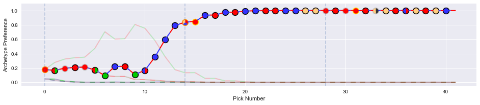

This plot has a few features:

  - Each dot represents a single draft pick. The color in the interior of the dot communicates the color identity of the card chosen, and the color of the outline represents the rarity of the card chosen.
  - The lines track the preferences of the drafter for each archetype. If the archetypes are the default color pairs, the lines will be colored accordingly.

In this example, the drafter ended up solidly in a red-blue archetype. They initially flirted with red-green, but then picked up some blue cards at the end of pack one, and took a tri-color rare (on color!) first pick in pack two.

Here's an example of a more difficult draft:

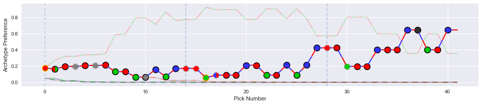

This drafter committed to red-green halfway though pack one, but had trouble picking up a good mass of green cards. Eventually the drafter settled on taking some blue cards, putting them in a bit of a three color bind. 


## Machine Learning

The machine learning algorithm is capable of learning archetype weights for each card from real world draft data.

### Training Data

Training data needs to contain a full record of multiple drafts:

  - The cards available to choose at each pick of the draft (i.e. what cards are left in the current pack).
  - The cards currently held by the drafter at each pick of the draft.
  - The chosen card at each pick of the draft.

If you have run some simulated drafts as described above, we have included a utility to load a modeling data set from the `sqlite` database used to store the draft data:

```
from draftbot import AnalyticTableConstructor

atc = AnalyticTableConstructor(db_path="../data/m20/drafts.sqlite")
X, y, y_names_mapping = atc.make_analytic_base_table()
```

The `X` and `y` returned here contain the needed training data and labels (Note: In this section we will used a simplified set of cards, a twenty-five card subset of the 2019 core set, as our running example):

```
X.info()

<class 'pandas.core.frame.DataFrame'>
MultiIndex: 1680000 entries, (9aefe0d5-be93-41dc-b6fb-a77a5dbc0faa, 0, 0) to (fb98d2e8-e3c4-421b-abfb-876af1f999ea, 7, 41)
Data columns (total 96 columns):
options_cavalier_of_dawn              1680000 non-null int64
options_ancestral_blade               1680000 non-null int64
options_fencing_ace                   1680000 non-null int64
options_pacifism                      1680000 non-null int64
options_raise_the_alarm               1680000 non-null int64
options_griffin_protector             1680000 non-null int64
options_inspiring_captain             1680000 non-null int64
options_cavalier_of_gales             1680000 non-null int64
...
cards_bag_of_holding                  1680000 non-null int64
cards_meteor_golem                    1680000 non-null int64
cards_heart-piercer_bow               1680000 non-null int64
dtypes: int64(96)
memory usage: 1.3+ GB

```

The `y` series contains card indexes instead of names:

```
y.head()

draft_id                              drafter  pick_number
9aefe0d5-be93-41dc-b6fb-a77a5dbc0faa  0        0              0
                                               1              1
                                               2              4
                                               3              5
                                               4              4
dtype: int64
```

The `y_names_mapping` dictionary is a lookup table mapping these card indexes to actual names.

```
y_names_mapping

{0: 'Cavalier of Dawn',
 1: 'Ancestral Blade',
 2: 'Fencing Ace',
 3: 'Pacifism',
 4: 'Raise the Alarm',
 ...
 }
 ```

### Training a Model

The machine learning module uses `pytorch` internally to learn the archetypes and weights. You will need to create a `TensorDataset` and a `DataLoader` object to supply training batches (and another to supply test data if desired). There is no current requirement that the training batches constitute picks from a single drafter of a single draft, though this could change in the future.

```
N_TRAINING = int(2 * X.shape[0] / 3)

train = TensorDataset(
    torch.from_numpy(X[:N_TRAINING].values.astype(np.float32)),
    torch.from_numpy(y[:N_TRAINING].values))
test = TensorDataset(
    torch.from_numpy(X[N_TRAINING:].values.astype(np.float32)),
    torch.from_numpy(y[N_TRAINING:].values))

train_batcher = DataLoader(train, batch_size=42*25)
test_batcher = DataLoader(test, batch_size=42*25)
```

To create a draftbot model and train it, use the following code outline:

```
from draftbot import DraftBotModel, DraftBotModelTrainer

N_CARDS = int(X.shape[1] / 2)

draftbot = DraftBotModel(n_cards=N_CARDS,
                         n_archetypes=10,
                         idx_names_mapping=y_names_mapping)

LEARNING_RATE_SCHEDULE = [0.01]*10 + [0.005]*10 + [0.001]*20 + [0.0001]*30
trainer = DraftBotModelTrainer(n_epochs=len(LEARNING_RATE_SCHEDULE), 
                               learning_rate=LEARNING_RATE_SCHEDULE,
                               loss_function=torch.nn.NLLLoss())
trainer.fit(draftbot, train_batcher, test_batcher=test_batcher)
```

The `DraftBotModelTrainier` tracks the training and testing losses, which are then easily plotted:

```
fig, ax = plt.subplots(figsize=(12, 4))

ax.plot(np.arange(trainer.n_epochs), trainer.epoch_training_losses)
ax.plot(np.arange(trainer.n_epochs), trainer.epoch_testing_losses)
```

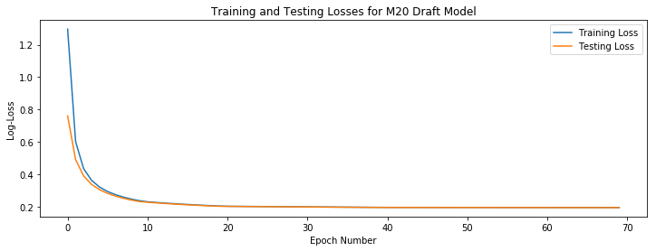

### Inspecting the Fit Weights

After training the model, the `weights` attribute contains the weights for each card in each draft archetype determined by the model. It is useful to put these in a DataFrame for easy inspection:

```
weights_df = pd.DataFrame(draftbot.weights.detach().numpy(),
                          index=y_names_mapping.values())
```

A heatmap of these weights reveals what the algorithm has learned:

```
fig, ax = plt.subplots(figsize=(8, 8))

ax.imshow(weights_df.T)

ax.set_yticks([], [])
ax.set_ylabel("Fit Archetypes")
ax.set_xticks(np.arange(len(weights_df)))
ax.set_xticklabels(weights_df.index, rotation='vertical')
ax.set_title("Card Archetype Weights")
```

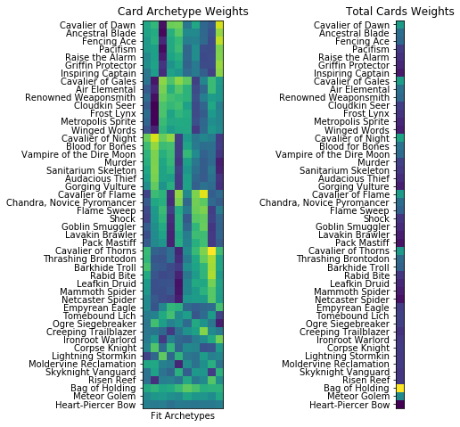

There are ten rows here, one for each archetype learned by the algorithm. Each column corresponds to a single card, so the entries here are the weight given to a card in a specified archetype (for information on how these weights are used to simulate a draft, see the description of draft simulation above).

The first 45 cards here are all single colored. For example, _Cavalier of Dawn_ through _Inspiring Captain_ are all white cards, and _Cavalier of Gales_ through _Winged Words_ are all blue. The banding structure of these weights is evident: within a single archetype the weights for a given card color are either all "on" or "off". So archetype weight is strongly influenced by color, as we would expect.

The last three cards, _Bag of Holding_, _Meteor Golumn_, and _Heart-Peircer Bow_, are all colorless (they can be useful in almost any deck). The weights for the colorless cards are not strongly influenced by archetype, which also meets our expectations.

Finally, _Empyrean Eagle_ (white-blue) through _Risen Reef_ (blue-green) are all two color cards. A pattern in their weights is harder to discern.

If we sum each column, and compute the *average* weight for each card, another pattern emerges.

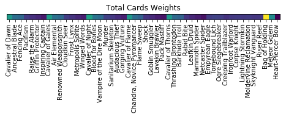

Here the pattern corresponds to the *rarity* of the card, a proxy for the power level of the card. Each _Cavilier_ is a rare, powerful card, and they are assigned on average a high weight. The next two cards in each color are uncommons, and the last four are common. The uncommons are assigned, on average, larger weights.

Finally, we can illuminate the situation a bit more by showing a correlation matrix between the weight vectors of each card:

```
fig, ax = plt.subplots(figsize=(8, 8))

corr = weights_df.T.corr()
ax.imshow(corr)

ax.set_yticks(np.arange(len(weights_df)))
_ = ax.set_yticklabels(weights_df.index)
```

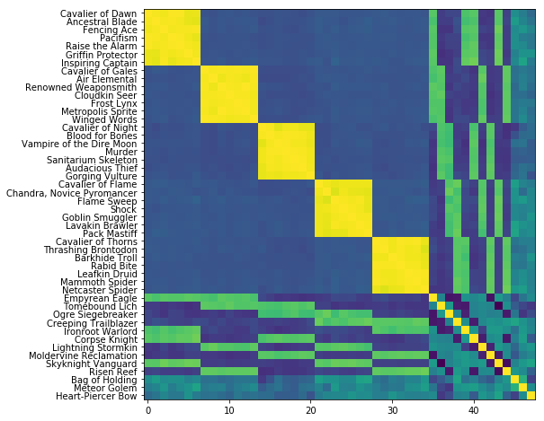

Each entry in this matrix is the correlation between two columns of the weight matrix above. There is some very evident structure.

The correlation between weight vectors for single colored cards is either very strong when the cards are the same color, or slightly negative, when the cards are different colors (purple here corresponds to a slightly negative correlation). 

Correlations between the weight vectors for two-colored and one-colored cards show an interesting pattern of bands.

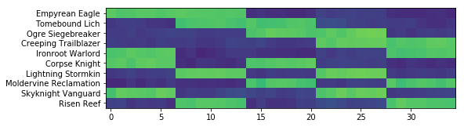

Each of these cards is two-colored (for example, _Risen Reef_ is blue *and* green, and can only be played in a deck with the resources to make both blue and green mana, a serious constraint). For each two colored card, there are fourteen (7 + 7) single colored cards that share at least one color with it (_Risen Reef_ shares a color with all mono-blue and all mono-green cards). This accounts for the banding in the above heatmap, where 2/5'ths of the weights are "on" in each row. The correlations between cards that share a color is quite strong, and is moderately negative if they do not.

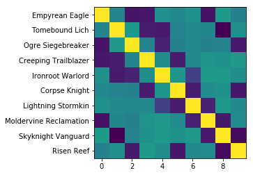

Correlations between weight vectors between two two-colored cards is positive when the cards share a color, and is negative when they do not.  Note that for any color pair (say white-blue), there are exactly three other color pairs disjoint from it (black-red, black-green, and red-green). This accounts for the three dark correlations in the two-colored card comparison region.

*Note:* This example model was fit to simulated draft data based on the default weight values described above, so this discussion only proves that the algorithm can learn reasonable structure from data containing *only* the options and picks in a draft. We hope to test this library on actual human draft data in the future, (if you have any available, please contact the author!).

### Simulating Drafts with Learned Weights

After training a `draftbot` model, we can use the fit weights to simulate drafters.

The first step is to write the resulting weights to a JSON file:

```
with open('data/weights.json', 'w') as f:
    draftbot.to_json(f)
```

This JSON file can now be used, just like the default weights file, to simulate drafts:

```
draft = Draft(n_drafters=8,
              n_rounds=3,
              n_cards_in_pack=14,
              cards_path='../data/m20/m20-cards-subset.json',
              card_values_path='data/weights.json')
draft.draft()
```

Since the archetypes no longer correspond to exact two color combinations, the resulting draft plots look a bit less on the nose:

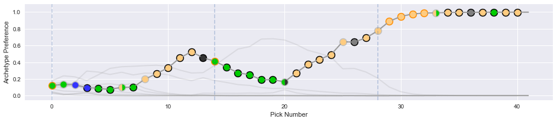


But the results are good, drafters find there way into reasonable two color archetypes. This is good support that this methodology has promise when applied to real world draft data.


## Further Work

The current implementation of algorithmic drafting contained here is about the simplest possible, while meeting the requirement of learnability from data. There are some places where it could be evidently improved.

### Non-Linear Preferences

When computing the drafter's archetype preferences, we used a simple matrix multiplication, making the preferences simple linear functions of the cards currently held by the drafter.

```
drafter_archetype_preferences = current_cards_held @ card_archetype_weights
```

This choice leads to a simple and interpretable model, that is easy to learn from the data. There is nothing *requiring* the preferences to be a linear function of our current state, we could instead learn the archetype preference as a non-linear function of the current state:

```
drafter_archetype_preferences = f(current_cards_held)
```

This may be important when fitting real world draft data. For example, there are many examples of cards synergising, where the value of one card is increased (or decreased) relative to expected just from color information by the possession of some other card (in statistical jargon, this would be an interaction effect). Simple linear preferences would have difficulty capturing such an effect, introducing a non-linear mapping would rectify this deficiency.

Possibly the most straight forward implementation of this idea would be to use a simple multi-layer neural network to parameterize `f`. This has the advantage of introducing flexible non-linearities, improving the fit to real world draft data, but also being relatively easy to learn.

Of course, given the simulated data we have used to test our ideas an implementations, this currently would not offer any benefit. We hope to try this out on real human draft data in the future.

### Memory and Other Information

Skilled human drafters consider more information than just the cards they currently hold when making draft picks. For example, practiced drafters attempt to actively identify the open archetype, by remembering what good cards they have been passed in the past, even if they did not select those cards. Tracking what cards the drafter has seen but not selected may be an important feature when fitting real human draft data.

Additionally, how far along the draft has progressed may influence human drafter's picks. In early picks, drafters may speculate on cards that may lead to synergistic interactions later on. Later on, drafters may value cards more if they fill holes in the strategic plan of their deck (see the concept of [mana curve](https://mtg.gamepedia.com/Mana_curve) in deck design for the most basic example of this). This would be a simple feature to add to our model, and again, it will probably be important when fitting to real world draft data.

